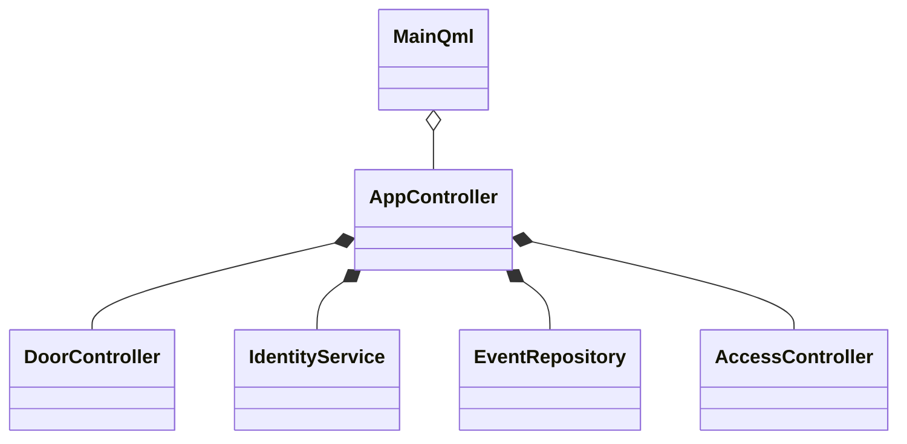

<div align="center">
  


# Система умной двери для питомца

**Виртуальная симуляция системы доступа с идентификацией по RFID-чипу на ошейнике**

[]()
[]()
[]()
[]()
[]()

</div>

---

## О проекте

**«Система умной двери для питомца»** — учебно-демонстрационное desktop-приложение на **Qt 6** и **C++**, имитирующее умную дверь для домашнего животного:

- идентификация **своего** питомца по **чипу RFID** на ошейнике (без камеры и прочих датчиков);
- **уведомления** о входе и выходе с датой и временем;
- **удалённое открытие и закрытие** двери;
- **безопасное закрытие**: при препятствии в проёме — отмена и **повтор через 15 секунд**;
- отдельный режим **симуляции** датчиков и сценариев (своя история событий).

> Это **цифровой двойник** (virtual): реальное железо (ESP32, замок, считыватель) в проекте не требуется — логика и интерфейс полностью на ПК.

---

## Возможности

### Основное приложение (вкладка «Главная»)

- отображение состояния двери: `Locked` / `Open` / `Closing` / `Blocked`;
- кнопки **«Открыть»** и **«Закрыть»**;
- лента **уведомлений** (вход, выход, дверь, тревоги);
- **автоматическая фиксация входа и выхода** по времени **открытия двери**;
- учёт **последнего входа**, **последнего выхода**, времени «на улице»;
- повторная попытка закрытия через **15 секунд**, если дверь не закрылась.

### Симуляция (отдельная вкладка)

- имитация **считывания RFID-чипа** у двери;
- переключатель **«Препятствие в проёме»**;
- **автосимуляция**: считывание чипа → **ожидание** действия пользователя («Открыть» на главной) → продолжение цикла;
- **отдельная история симуляции** (не смешивается с историей приложения).

---

## Использование

### Первый запуск

1. Соберите проект в **Qt Creator** (см. раздел [Сборка](#сборка)).
2. Откройте вкладку **«Главная»** — здесь только дверь и уведомления.
3. Перейдите в **«Симуляция»**, нажмите **«Считать чип у двери»**.
4. На **«Главной»** появится уведомление: питомец у двери — нажмите **«Открыть»**.
5. Вход зафиксируется **автоматически** (дата и время открытия двери).

### Типовой сценарий

| Шаг | Действие | Результат |
|-----|----------|-----------|
| 1 | Симуляция → «Считать чип у двери» | Чип принят, ожидание открытия |
| 2 | Главная → «Открыть» | Дверь открыта, **вход** в истории |
| 3 | Главная → «Закрыть» | Дверь закрыта |
| 4 | Снова «Открыть» (питомец дома) | **Выход** зафиксирован по времени открытия |

### Препятствие в проёме

1. **Симуляция** → включите **«Препятствие в проёме»**.
2. **Главная** → **«Закрыть»**.
3. Дверь **не закроется** → уведомление и **повтор через 15 секунд**.

### Автосимуляция

1. **Симуляция** → **«Запустить»** (автосимуляция).
2. Периодически имитируется считывание чипа.
3. Таймер **останавливается**, пока вы не нажмёте **«Открыть»** на главной.
4. После открытия цикл **продолжается**.

---

## Как определяется «свой» питомец

Используется только **белый список ID чипов** (имитация RFID на ошейнике):

| ID чипа (пример) | Статус |
|------------------|--------|
| `cat_murzik` | свой питомец |
| `cat_barsik` | свой питомец |
| `dog_rex` | свой питомец |
| любой другой | доступ запрещён |

---

## Сборка

### Требования

- **Windows 10/11**
- **Qt 6.11** (или 6.5+) с модулями:
  - Qt Quick
  - Qt SQL
- **CMake 3.21+**
- Компилятор: **MinGW 64-bit** (рекомендуется) или MSVC
- **Qt Creator** 15+

> (избегайте кириллицы в пути — OneDrive/«Рабочий стол» ломает кэш CMake).

### Qt Maintenance Tool

Установите компоненты для вашего kit:

- Qt Quick / Declarative  
- Qt SQL  

### Сборка в Qt Creator

1. **File → Open File or Project…** → `CMakeLists.txt`
2. Kit: **Desktop Qt 6.11.0 MinGW 64-bit**
3. **Build → Clear CMake Configuration**
4. **Run CMake** → **Build** (Ctrl+B) → **Run** (Ctrl+R)

### Сборка из командной строки (пример)

```bash
cd C:\Qt\Projects\...
mkdir build
cd build
cmake .. -G "MinGW Makefiles" -DCMAKE_PREFIX_PATH=C:/Qt/6.11.0/mingw_64
cmake --build .
```

> Подставьте свой путь к Qt (`CMAKE_PREFIX_PATH`).

### Если CMake ругается на кэш

```text
The source does not match the source used to generate cache
```

**Решение:** удалите папку `build` целиком → **Clear CMake Configuration** → **Run CMake** снова.

---

## Структура проекта

```text
CatDoorVirtualV2/
├── CMakeLists.txt
├── README.md
├── qml/
│   └── Main.qml              # UI: Главная, Симуляция, История
├── src/
│   ├── main.cpp
│   ├── AppController.*       # логика приложения, уведомления
│   ├── DoorController.*      # автомат двери
│   ├── IdentityService.*     # проверка RFID-чипа
│   ├── EventRepository.*     # SQLite (main / simulation)
│   └── AccessController.*    # роли Owner / Family / Viewer
└── build/                    # каталог сборки (не в git)
```

---

## Архитектура (кратко)



| Класс | Назначение |
|-------|------------|
| `AppController` | Связь UI, уведомления, симуляция, вход/выход |
| `DoorController` | Состояния двери, препятствие, закрытие |
| `IdentityService` | Свой/чужой чип (RFID) |
| `EventRepository` | История в SQLite |
| `AccessController` | Права пользователя |

---

## Планы / железо (опционально)

В реальном прототипе планировалось:

- **ESP32** + считыватель **RFID RC522** на ошейнике;
- магнитный замок + датчик препятствия в проёме;
- MQTT / push на телефон (в виртуальной версии — уведомления в приложении).

---

<div align="center">

**Система умной двери для питомца** · Qt 6 + C++

</div>
